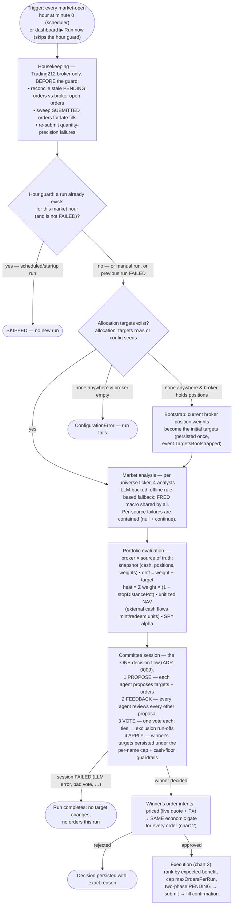
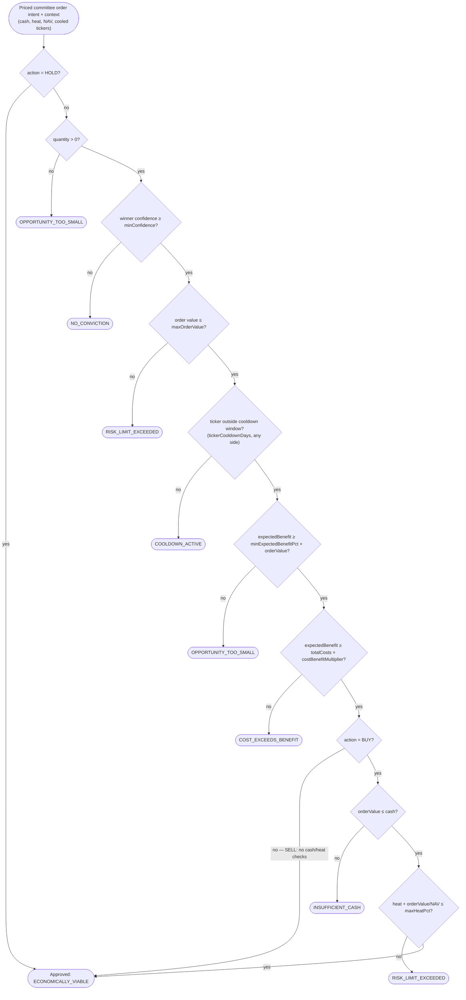
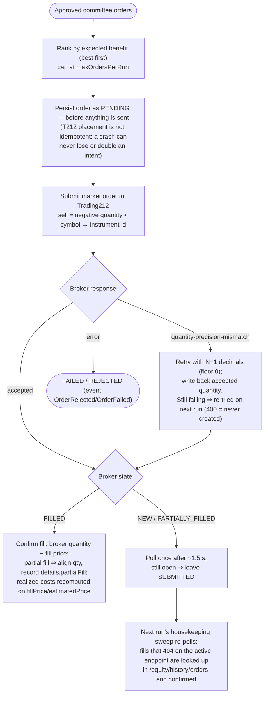

# Investment decision — flowchart

Visual companion to [DECISION_PROCESS.md](./DECISION_PROCESS.md). Three Mermaid charts: the end-to-end hourly pipeline, the economic-correctness gate (`DecisionEngine.evaluate`, `src/domain/decision.ts`), and order execution. Every box below is implemented behavior, not aspiration.

Since [ADR 0009](./ADRs/0009-unified-committee-decision-flow.md) there is exactly **one** flow: the Asset Allocation Committee manages every allocation change and every order.

---

## 1. End-to-end: from trigger to order

---

## 2. The economic-correctness gate (`DecisionEngine.evaluate`)

Checks run **in this exact order**; the first failure sets the rejection reason. The gate is identical for every order — the committee never bypasses it.

Where `expectedBenefit = orderValue × expectedReturnPerTradePct/100 × (0.5 + 0.5 × confidence)`.
Every decision — approved **or** rejected — is persisted with its full rationale.

---

## 3. Execution: approved decisions become orders

Crash recovery: stale PENDING (>15 min) is matched against broker open orders (ticker, side, qty, ±15 min) — match ⇒ adopt broker id, no match ⇒ FAILED. **Never blind re-submission.**
